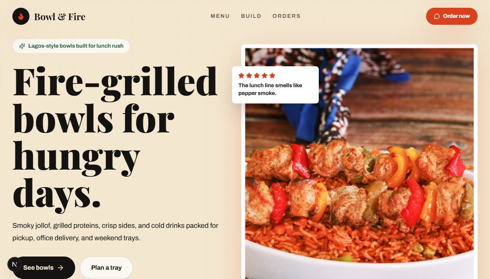

# Bowl & Fire

A polished one-page restaurant site for Bowl & Fire, a Lagos-style Nigerian rice bowl concept built for lunch orders, pickup, delivery, and weekend trays.



## Overview

Bowl & Fire is a responsive Next.js landing page with an interactive order section. It presents signature bowls, explains the build-your-own-bowl flow, and lets customers prepare a WhatsApp order message with selected base, protein, extra, quantity, and estimated total.

## Features

- Full-screen hero with brand navigation, call-to-action links, operating highlights, and food photography.
- Animated ticker for quick product cues like smoky jollof, grilled protein, plantain, office lunch, and delivery.
- Signature menu section with prices, descriptions, tags, and image-backed cards.
- Build-your-bowl section with a simple three-step ordering flow.
- Interactive order board with selectable bases, proteins, extras, quantity controls, live total calculation, and WhatsApp checkout link.
- Footer with hours, contact details, location, and social links.
- Responsive layout styled with Tailwind CSS and enhanced with Framer Motion animations.

## Tech Stack

- [Next.js](https://nextjs.org/) 15
- [React](https://react.dev/) 19
- [TypeScript](https://www.typescriptlang.org/)
- [Tailwind CSS](https://tailwindcss.com/)
- [Framer Motion](https://www.framer.com/motion/)
- [Lucide React](https://lucide.dev/)

## Project Structure

```text
.
├── public/
├── src/
│   ├── app/
│   │   ├── globals.css
│   │   ├── layout.tsx
│   │   └── page.tsx
│   └── components/
│       ├── BuildSection.tsx
│       ├── Footer.tsx
│       ├── Hero.tsx
│       ├── MenuSection.tsx
│       ├── Navbar.tsx
│       ├── OrdersSection.tsx
│       ├── SocialIcons.tsx
│       ├── Ticker.tsx
│       └── content.ts
├── preview.png
├── tailwind.config.ts
└── package.json
```

## Getting Started

### Prerequisites

- Node.js 18.18 or newer
- npm

### Installation

```bash
npm install
```

### Development

```bash
npm run dev
```

Open [http://localhost:3000](http://localhost:3000) to view the site.

### Production Build

```bash
npm run build
npm run start
```

## Available Scripts

| Script | Description |
| --- | --- |
| `npm run dev` | Starts the local Next.js development server. |
| `npm run build` | Creates an optimized production build. |
| `npm run start` | Serves the production build. |
| `npm run lint` | Runs the configured Next.js lint command. |

## Editing Content

Most menu and order content lives in [`src/components/content.ts`](./src/components/content.ts):

- `menu` controls the signature bowl cards.
- `steps` controls the build-your-bowl steps.
- `bases`, `proteins`, and `extras` power the order builder and live total.
- `ticker` controls the scrolling text strip.
- `imageCredits` keeps the image labels, source URLs, and Unsplash credit links together.

Brand metadata is defined in [`src/app/layout.tsx`](./src/app/layout.tsx). The main page composition is in [`src/app/page.tsx`](./src/app/page.tsx).

## Customization Notes

- Update the placeholder phone number `+234 800 000 0000` and WhatsApp links in `Navbar.tsx`, `OrdersSection.tsx`, and `Footer.tsx` before going live.
- Replace `orders@bowlandfire.com` with the production contact email in `Footer.tsx`.
- Update the pickup address and operating hours in `OrdersSection.tsx` and `Footer.tsx` if the business details change.
- Tailwind brand colors, font families, shadows, and animations are configured in `tailwind.config.ts`.
- Global page background, text rendering, selection color, and grain overlay styles live in `src/app/globals.css`.

## Image Credits

The current food and drink imagery is sourced from Unsplash and listed in `src/components/content.ts`:

- Jollof rice with chicken skewers
- Grilled chicken rice bowl
- Chicken salad rice bowl
- Zobo drink

Keep image credit links intact when replacing or redistributing the imagery.

## Deployment

This project is ready for any platform that supports Next.js, such as Vercel, Netlify, or a Node.js server. For Vercel, connect the repository and use the default Next.js build settings:

```text
Build command: npm run build
Output: .next
Install command: npm install
```

## License

This project is private by default. Add a license before distributing or open-sourcing it.
